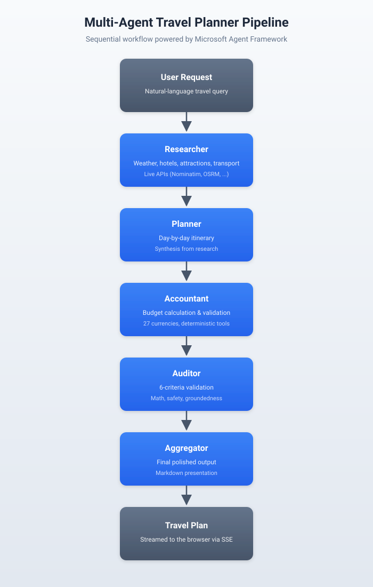

# Local Agent Travel Planner

A multi-agent AI travel planning system built with .NET 10 and the [Microsoft Agent Framework (MAF)](https://github.com/microsoft/agents). Five specialized agents collaborate sequentially to research a destination, build an itinerary, calculate a budget, audit the plan against six quality criteria, and present a polished result.

The system supports five LLM providers — local Ollama, Anthropic Claude, Google Gemini, Groq, and OpenRouter — through a shared `IChatClient` abstraction, so you can develop offline and switch to a hosted model with a single config change.



## Features

- **Sequential 5-agent pipeline** — Researcher → Planner → Accountant → Auditor → Aggregator
- **Multi-turn conversations** — follow-up messages refine the plan in place; the latest plan stays pinned in the right pane while you chat
- **Routed turns** — a lightweight LLM router classifies each follow-up (`Full` / `Replan` / `Rebudget` / `Reaudit` / `Clarify` / `OffTopic`) and runs only the agents whose work needs to change
- **Provider-swappable LLMs** — Ollama (local), Anthropic Claude, Google Gemini, Groq, OpenRouter; auto-detected from environment with explicit override via the UI dropdown
- **Reliability middleware** — `RetryingChatClient` retries 408/429/5xx and transport errors with exponential backoff + jitter; `MaximumIterationsPerRequest=8` caps runaway tool-calling loops on weaker models
- **"Changes This Turn" delta bullets** — the Aggregator emits a short "what changed" section on follow-up subset routes; the frontend surfaces it in the chat bubble while the right pane keeps the full plan
- **Weak-model safety nets** — server-side `EnforceAuditorVerdict` regex-checks the Auditor's actual decision and rewrites the plan header on mismatch; anti-placeholder rule blocks bracketed template leakage
- **Rich UI restoration** — per-turn `Route`, `AgentsRun`, `Provider`, `Model`, `DurationMs`, `ChangeSummary`, and per-agent output content persist to SQLite so a page refresh rebuilds the route chip, pipeline dots, agent-details tabs, and status line for every past turn
- **Live API integration** — Nominatim geocoding, Open-Meteo weather, OpenTripMap POIs, OSRM routing
- **Deterministic validation** — budget math, travel-time feasibility, safety, groundedness, completeness
- **SQLite-backed persistence** — conversations and message history survive restarts; pluggable `IConversationStore` lets you swap in another backend
- **Per-conversation concurrency control** — async lock returns `409 Conflict` when a second turn races the first
- **Real-time browser UI** — three-pane layout (conversation sidebar / chat / live plan); SSE streams per-agent progress with throttled Markdown rendering
- **Production hardening** — API key auth, rate limiting, HTTPS redirect, structured logging (Serilog)
- **Prompt injection guardrails** — pre-pipeline intent classifier + per-agent scope enforcement
- **Dockerized deployment** — multi-stage build with nginx reverse proxy, persistent SQLite volume
- **Quality evaluation** — `Microsoft.Extensions.AI.Evaluation` with 6 LLM-as-judge metrics

## Quick Start

### Option 1: Docker (recommended)

```bash
# Copy the env template
cp .env.example .env

# Edit .env — set API_KEY (required) and any of ANTHROPIC_API_KEY,
# GEMINI_API_KEY, GROQ_API_KEY, OPEN_ROUTER_AI_KEY. If none are set,
# the system falls back to a local Ollama instance.

# Start the stack (app + nginx)
docker compose up -d

# Open http://localhost in your browser
```

### Option 2: Local .NET

Prerequisites:
- .NET 10 SDK
- Ollama running locally with `qwen2.5:7b` (or another model — override with `OLLAMA_MODEL`), **or** any one of an Anthropic / Gemini / Groq / OpenRouter API key

```bash
# Clone and build
git clone https://github.com/bimalghartimagar/LocalAgentTravelPlanner.git
cd LocalAgentTravelPlanner
dotnet build LocalAgentTravelPlanner.sln

# Run the Web API
dotnet run --project Api/LocalAgentTravelPlanner.Api.csproj
# Open http://localhost:5286

# Or run the console app
dotnet run --project LocalAgentTravelPlanner.csproj
```

The dev environment uses `dev-key-12345` as the API key (set in `appsettings.Development.json`). The browser UI prompts for the key on first request and stores it in `sessionStorage`.

## Configuration

| Key | Required | Source | Purpose |
|-----|----------|--------|---------|
| `ApiKey` | Yes | appsettings / env / `ApiKeyFile` | Authenticates API requests via `X-Api-Key` header |
| `ANTHROPIC_API_KEY` | No | appsettings / env | Anthropic Claude API key |
| `GEMINI_API_KEY` | No | appsettings / env | Google Gemini API key (used against the OpenAI-compatible endpoint) |
| `GROQ_API_KEY` | No | appsettings / env | Groq API key (fast inference on hosted open-source models) |
| `OPEN_ROUTER_AI_KEY` | No | appsettings / env | OpenRouter API key (aggregator; single billing point across many providers) |
| `OLLAMA_HOST` | No | env | Ollama endpoint (default: `http://localhost:11434`) |
| `ANTHROPIC_MODEL` | No | env | Override the default Anthropic model (default: `claude-sonnet-4-20250514`) |
| `GEMINI_MODEL` | No | env | Override the default Gemini model (default: `gemini-2.5-flash`) |
| `GROQ_MODEL` | No | env | Override the default Groq model (default: `llama-3.1-8b-instant`) |
| `OPEN_ROUTER_MODEL` | No | env | Override the default OpenRouter model (default: `deepseek/deepseek-chat`) |
| `OLLAMA_MODEL` | No | appsettings / env | Ollama model tag (default: `qwen3-coder:30b`) |
| `ApiKeyFile` | No | appsettings | Path to a file containing the API key (Docker secrets) |
| `Conversations:Backend` | No | appsettings / env | `Sqlite` (default) or `InMemory` — pick the conversation store implementation |
| `ConnectionStrings:Conversations` | No | appsettings / env | SQLite connection string. Defaults to `Data Source=conversations.db` |
| `OTEL_EXPORTER_OTLP_ENDPOINT` | No | env | OTLP endpoint for OpenTelemetry traces (e.g. `http://localhost:4317`). If unset, traces stay in-process. |
| `OTEL_SERVICE_NAME` | No | env | Service name attribute on emitted spans (default: `LocalAgentTravelPlanner`) |
| `LITESTREAM_REPLICA_URL` | No | env | Object-storage URL for Litestream continuous SQLite replication (`s3://`, `gs://`, `abs://`, `sftp://`, `file://`). Required when running `docker compose --profile backup up` |
| `ROUTER_PROVIDER` | No | env | Dedicated router provider — routes to a cheaper client per turn. Defaults to the auto-detected main provider. |
| `ROUTER_MODEL` | No | env | Router model override (e.g. `claude-haiku-4-5-20251001`, `gpt-4o-mini`, `gemini-2.5-flash`). Enables the cheap-router split; falls back to provider defaults if omitted. |

Auto-detect precedence: `Anthropic` → `OpenRouter` → `Groq` → `Gemini` → `Ollama`. The UI dropdown overrides this. Only one provider is used per request.

ASP.NET's configuration system loads keys with this precedence (last wins):

```
appsettings.json → appsettings.Development.json → environment variables
```

For deployments, mount a secret file and point `ApiKeyFile` at it, or set the env vars directly.

## API Endpoints

### One-shot (unchanged from v1)

| Method | Route | Auth | Rate Limited | Description |
|--------|-------|------|-------------|-------------|
| `POST` | `/api/travel/plan` | API key | 5/min | Blocking — returns full plan as JSON |
| `GET` | `/api/travel/plan/stream` | API key | 5/min | SSE — streams per-agent events |
| `GET` | `/api/travel/health` | None | No | Provider availability check (UI badges) |
| `GET` | `/health/live` | None | No | Liveness — cheap, no dependencies. Used by Docker HEALTHCHECK. |
| `GET` | `/health/ready` | None | No | Readiness — DB write-round-trip probe + provider config check. Returns 503 if degraded. |

### Conversation surface

| Method | Route | Auth | Rate Limited | Description |
|--------|-------|------|-------------|-------------|
| `POST` | `/api/conversations` | API key | No | Create a new conversation, returns `{id, createdAt}` |
| `GET` | `/api/conversations` | API key | No | List conversations sorted by `lastActivity` desc |
| `GET` | `/api/conversations/{id}` | API key | No | Full state: history + `latestPlan` |
| `DELETE` | `/api/conversations/{id}` | API key | No | Hard delete (cascades to messages) |
| `POST` | `/api/conversations/{id}/messages` | API key | 5/min | Blocking turn — returns `{route, agentsRun, plan, assistantReply?, error?, pendingDecision?}` |
| `GET` | `/api/conversations/{id}/messages/stream` | API key | 5/min | SSE turn — same vocabulary as `/plan/stream` plus `route`, `plan-final`, `clarified`, `approval-required` |
| `PATCH` | `/api/conversations/{id}/settings` | API key | No | Toggle per-conversation settings (currently `requireApproval`) |
| `GET` | `/api/conversations/{id}/decision/stream` | API key | 5/min | Resume a paused turn — SSE Aggregator run on approve, or Replan chain on reject-with-feedback |
| `DELETE` | `/api/conversations/{id}/pending` | API key | No | Discard a pending draft; the previous plan (if any) is unchanged |

A second turn issued against a conversation that's already mid-stream returns `409 Conflict` immediately. Same result if a pending decision is outstanding — clients must resolve via `/decision/stream` or `DELETE /pending` first.

### Structured errors

All error responses ship an `ApiError` envelope:

```json
{ "code": "conversation.pending_decision_open", "error": "This conversation has a pending decision...",
  "extras": { "pendingDecision": { "turnIndex": 2, "route": "replan", "auditorVerdict": "APPROVED", ... } } }
```

Clients should switch on the stable `code` field. See `Api/Models/ApiError.cs` for the registry (14 codes covering auth, validation, resource state, upstream, rate).

### SSE event vocabulary

| Event | Payload | When |
|---|---|---|
| `init` | `{provider, model, conversationId?}` | First event of the stream |
| `route` | `{route, agentsToRun}` | Once, right after the router decides (conversation endpoint only) |
| `agent-start` | `{agent, status, progressPercent}` | When each agent in the subset starts |
| `content` | `{agent, content, progressPercent}` | Per-token streamed output |
| `agent-complete` | `{agent, progressPercent}` | When each agent finishes |
| `plan-final` | `{plan, changeSummary?}` | After a plan-changing turn; carries full markdown + optional Changes This Turn delta |
| `clarified` | `{reply}` | After a `Clarify` / `OffTopic` turn; right pane stays unchanged |
| `approval-required` | `PendingDecisionDto` | Human-in-the-loop pause — turn will resume via `/decision/stream` |
| `error` | `{agent, content}` | Any agent or workflow failure |
| `complete` | `{progressPercent}` | Terminal event |

The streaming endpoints also emit invisible `: keep-alive` comment frames every 15 seconds so reverse proxies (nginx `proxy_read_timeout`, cloudflare, etc.) don't tear down idle streams during long Auditor phases.

### Observability

- **Structured logs** — Serilog console + rolling daily file (`logs/api-YYYYMMDD.log`, 14-day retention). Turn-completion events carry `ConversationId`, `Route`, `AgentsRun`, `DurationMs`, `Success`, router token usage.
- **OpenTelemetry traces** — `LocalAgentTravelPlanner` activity source emits `conversation.turn` and `conversation.aggregator_phase` spans with tags for conversation id, route, provider, model, gate state, upstream duration. Ships via OTLP when `OTEL_EXPORTER_OTLP_ENDPOINT` is set (Jaeger, Tempo, Honeycomb, Datadog all accept). AspNetCore + HttpClient instrumentation come out of the box; `/health/*` probes are filtered so traces don't get flooded.

### Backup + restore (Litestream)

Continuous SQLite replication ships as an opt-in docker-compose sidecar:

```bash
# .env
LITESTREAM_REPLICA_URL=s3://your-bucket/travel-planner
LITESTREAM_ACCESS_KEY_ID=...
LITESTREAM_SECRET_ACCESS_KEY=...

docker compose --profile backup up -d
```

The sidecar shares the app-data volume and streams WAL frames every 10s to the configured replica; snapshots every 6h with 72h retention. Restore is a single command:

```bash
docker run --rm -v app-data:/data litestream/litestream:0.3 \
  restore -o /data/conversations.db "$LITESTREAM_REPLICA_URL"
```

### Example requests

```bash
# One-shot
curl -X POST http://localhost:5286/api/travel/plan \
  -H "X-Api-Key: dev-key-12345" \
  -H "Content-Type: application/json" \
  -d '{"request": "5-day trip from Tokyo to Kyoto, budget $1500"}'

# Conversation
CID=$(curl -s -X POST -H "X-Api-Key: dev-key-12345" http://localhost:5286/api/conversations | jq -r .id)
curl -X POST "http://localhost:5286/api/conversations/$CID/messages" \
  -H "X-Api-Key: dev-key-12345" \
  -H "Content-Type: application/json" \
  -d '{"message": "5-day trip from Tokyo to Kyoto, budget $1500"}'
curl -X POST "http://localhost:5286/api/conversations/$CID/messages" \
  -H "X-Api-Key: dev-key-12345" \
  -H "Content-Type: application/json" \
  -d '{"message": "make day 3 cheaper"}'
```

## Architecture

### Agent pipeline

```
User Request
    ↓
Researcher  →  gathers destination data via live APIs
    ↓
Planner     →  builds day-by-day itinerary
    ↓
Accountant  →  calculates budget across 27 currencies
    ↓
Auditor     →  validates on 6 criteria using deterministic tools
    ↓
Aggregator  →  synthesizes final user-facing output
    ↓
Streamed to the browser via SSE
```

Each agent receives the full conversation history from prior agents. The Auditor scores the plan on:

- **Financial integrity** — math is correct, totals match
- **Temporal logic** — travel times realistic, no overlapping activities
- **Safety** — no restricted areas without permits, no dangerous activities
- **Groundedness** — recommendations actually appeared in research
- **Relevance** — matches the user's stated requirements
- **Completeness** — all required sections present

### Project structure

| Project | Type | Purpose |
|---------|------|---------|
| `LocalAgentTravelPlanner.csproj` | Console | Core agents, services, models, tools |
| `Api/` | ASP.NET Core | REST + SSE endpoints, middleware, static UI |
| `Tests/` | xUnit | Unit tests + MEAI evaluation tests |

### Middleware pipeline

```
Request → ForwardedHeaders → Serilog → HTTPS Redirect → ApiKeyMiddleware → RateLimiter → StaticFiles → Controllers
```

### Key technical decisions

- **`IChatClient` abstraction** — agents are provider-agnostic; Ollama, Anthropic, Gemini, Groq, and OpenRouter all satisfy the same interface
- **OpenAI-compatible endpoints for hosted providers** — Gemini, Groq, and OpenRouter share the standard `OpenAIClient` with different `Endpoint` overrides; no provider-specific SDKs required
- **`AnthropicOptionsInjector` middleware** — `DelegatingChatClient` that injects `ModelId` and `MaxOutputTokens` per request (Anthropic SDK requires both, MAF doesn't set them)
- **`RetryingChatClient` middleware** — exponential backoff + jitter on 408/429/500/502/503/504, `HttpRequestException`, and timeout-wrapped `TaskCanceledException`; placed before `UseFunctionInvocation` so each tool-calling sub-turn gets its own retry budget
- **Tool-loop guards** — `FunctionInvokingChatClient.MaximumIterationsPerRequest=8` caps runaway tool-calling; Researcher/Accountant/Auditor prompts include a "Tool Call Discipline" section limiting redundant calls
- **Pre-pipeline intent classifier** — one cheap LLM call rejects off-topic requests before the 5-agent pipeline runs
- **Per-turn router** — a single short LLM call classifies follow-ups into one of six routes; subset workflows skip the agents whose work doesn't need to change. Q&A about the plan (e.g. "any safety issues day 4?") routes to `Clarify`; only explicit "re-validate the plan" style commands route to `Reaudit`
- **"Changes This Turn" delta** — Aggregator emits a parseable `## 🔄 Changes This Turn` section on subset routes; `SplitPlanAndChanges` extracts it server-side and threads through `TravelPlanProgress`, the SSE `plan-final` event, and `TurnMetadata.ChangeSummary`
- **`EnforceAuditorVerdict` safety net** — regex extracts the Auditor's actual `APPROVED`/`FLAGGED`/`REJECTED` decision from its output and rewrites the plan header on mismatch; emits `LogWarning` so drift frequency is measurable
- **NO PLACEHOLDERS Aggregator rule** — explicit anti-bracket instruction blocks weak models from emitting literal template tokens like `[Insert Date]` or `[Hotel]`
- **History at the service layer** — conversation history is passed into MAF workflows as `List<ChatMessage>`; commit-on-success means a failed or cancelled turn leaves the conversation untouched
- **Aggregator dual-mode** — one prompt addendum lets the Aggregator detect whether it's in plan-generation mode or chat-answer mode based on what's in its input this turn
- **MAF silent failure handling** — `ExecutorFailedEvent` and `WorkflowErrorEvent` are explicitly handled because MAF otherwise completes with empty output on agent errors
- **Empty content filtering** — `AgentRunUpdateEvent` fires with empty data during tool-calling turns; filtered before reaching the SSE stream
- **`fetch + ReadableStream` over `EventSource`** — avoids `EventSource`'s auto-reconnect restarting expensive multi-agent runs
- **`IConversationStore` interface** — in-memory (default opt-in for tests) or SQLite (default for production); pluggable for future Postgres/Redis
- **SQLite WAL mode + `WITHOUT ROWID`** — reader-during-writer concurrency, 32-char GUID primary keys, FK cascade from `Messages` and `Turns` to `Conversations`
- **Rich per-turn persistence** — new `Turns` table (`Route`, `AgentsRun`, `DurationMs`, `Provider`, `Model`, `ChangeSummary`) and `TurnAgentContent` table (per-agent markdown output) let a page refresh reconstruct the full assistant bubble UI including route chip, mini pipeline, and agent-details tabs
- **Backwards-compatible SQLite migrations** — `TryAddColumn` wraps `ALTER TABLE ... ADD COLUMN` in a try/catch since SQLite lacks `ADD COLUMN IF NOT EXISTS`
- **Non-blocking per-conversation lock** — `SemaphoreSlim.WaitAsync(0)` throws `ConversationBusyException` on contention; controller maps to HTTP 409 with no SSE preamble

## Testing

```bash
# Run all unit tests (163 tests)
dotnet test Tests/LocalAgentTravelPlanner.Tests.csproj

# Run a specific test class
dotnet test Tests/ --filter "FullyQualifiedName~BudgetToolsTests"

# Run LLM-as-judge evaluation tests (requires a live provider)
ENABLE_EVAL_TESTS=true dotnet test Tests/ --filter "Category=Evaluation"
```

Evaluation tests use [`Microsoft.Extensions.AI.Evaluation.Quality`](https://learn.microsoft.com/en-us/dotnet/ai/conceptual/evaluation-overview) with metrics for Coherence, Fluency, Relevance, Truth, Completeness, and Groundedness. They are skipped by default to keep the unit-test loop fast.

## Tech Stack

- **.NET 10** with C# 13
- **Microsoft Agent Framework 1.0.0-preview** for agent orchestration
- **Microsoft.Extensions.AI** for the `IChatClient` abstraction
- **Microsoft.Extensions.AI.OpenAI** for Gemini, Groq, and OpenRouter via the OpenAI-compatible endpoint pattern
- **Anthropic.SDK** for Claude integration
- **OllamaSharp** for local model integration
- **Microsoft.Data.Sqlite + Dapper** for conversation persistence
- **ASP.NET Core** Web API with built-in rate limiting
- **Serilog** for structured logging
- **xUnit + Moq + FluentAssertions** for testing
- **nginx** as the production reverse proxy
- **Docker + docker-compose** for deployment

## Documentation

- [Building a Multi-Agent Travel Planner with Microsoft Agent Framework and .NET](https://www.endpointdev.com/blog/2026/03/building-multi-agent-travel-planner-dotnet/) — original walkthrough on the End Point blog
- [Adding Multi-Turn Conversations to a Multi-Agent Travel Planner](https://www.endpointdev.com/blog/2026/06/adding-conversations-to-multi-agent-travel-planner/) — the routed-pipeline + persistence + locking follow-up
- [`CLAUDE.md`](CLAUDE.md) — internal guidance for Claude Code agents working on this repo
- [`AGENTS.md`](AGENTS.md) — same content for Codex

## License

This repository does not yet have an open-source license. All rights reserved until a license is added.
